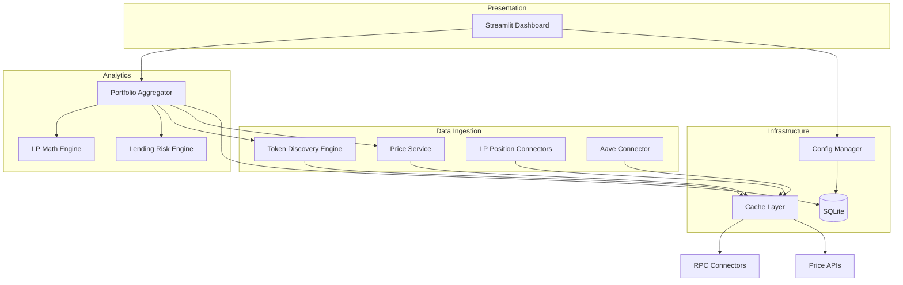

# Design Document: DeFi Portfolio PoC

## Overview

This design describes a local-first, read-only DeFi portfolio analytics tool built in Python. The system discovers ERC-20 tokens across multiple wallets on Ethereum, Arbitrum, and Base, fetches LP positions from Uniswap v2/v3, Aerodrome, and Camelot, retrieves Aave v3 lending data, prices everything via a tiered API fallback, stores daily snapshots in SQLite, and renders all analytics in a Streamlit dashboard.

The architecture follows a layered approach: connectors (chain RPC, protocol indexers, price APIs) → analytics engines (LP math, lending risk) → storage (SQLite) → presentation (Streamlit). All connectors implement abstract interfaces for extensibility. A shared in-memory cache sits in front of all external calls.

Technology stack:
- Python 3.11+ in a virtual environment
- `web3.py` for RPC interactions
- `requests` / `httpx` for REST API calls
- `streamlit` for the dashboard
- `sqlite3` (stdlib) for persistence
- `plotly` for charts
- `pytest` + `hypothesis` for testing

## Architecture



### Data Flow

1. User configures wallet addresses via Strategy Config tab → persisted by Config Manager
2. On refresh/load, Portfolio Aggregator iterates the Wallet_Set
3. For each wallet: Token_Discovery_Engine scans transfer logs → discovers token contracts → fetches balances
4. Price_Service prices all discovered tokens (CoinGecko → Binance → DefiLlama fallback)
5. LP Position Connectors fetch NFT positions (v3) and LP token balances (v2) per protocol
6. LP_Math_Engine computes per-position and aggregated analytics
7. Aave Connector fetches supply/borrow data → Lending_Risk_Engine computes risk metrics
8. Snapshot_Recorder persists daily aggregate to SQLite
9. Dashboard renders all data across tabs

## Components and Interfaces

### Abstract Interfaces

```python
from abc import ABC, abstractmethod
from dataclasses import dataclass
from typing import Protocol

class ChainConnector(ABC):
    """Abstract interface for chain-specific RPC interactions."""

    @abstractmethod
    def get_token_transfers(self, wallet: str) -> list[TokenTransfer]:
        """Fetch ERC-20 Transfer logs for a wallet."""
        ...

    @abstractmethod
    def get_token_balance(self, wallet: str, token_address: str) -> int:
        """Fetch raw balance of a token for a wallet."""
        ...

    @abstractmethod
    def get_token_metadata(self, token_address: str) -> TokenMetadata:
        """Fetch symbol and decimals for a token contract."""
        ...

    @abstractmethod
    def get_block_timestamp(self, block_number: int) -> int:
        """Fetch timestamp for a block number."""
        ...


class PriceProvider(ABC):
    """Abstract interface for price data sources."""

    @abstractmethod
    def get_prices(self, token_addresses: list[str], chain: str) -> dict[str, float]:
        """Fetch USD prices for a list of token addresses. Returns {address: price}."""
        ...


class LPConnector(ABC):
    """Abstract interface for LP protocol connectors."""

    @abstractmethod
    def get_positions(self, wallet: str, chain: str) -> list[RawLPPosition]:
        """Fetch all LP positions for a wallet on a chain."""
        ...

    @abstractmethod
    def get_pool_data(self, pool_address: str) -> PoolData:
        """Fetch current pool state (reserves, tick, fee tier, TVL)."""
        ...


class LendingConnector(ABC):
    """Abstract interface for lending protocol connectors."""

    @abstractmethod
    def get_positions(self, wallet: str, chain: str) -> LendingPositionRaw:
        """Fetch supply and borrow positions for a wallet."""
        ...
```

### Concrete Implementations

| Interface | Implementation | Notes |
|-----------|---------------|-------|
| ChainConnector | `EthereumConnector`, `ArbitrumConnector`, `BaseConnector` | Each wraps web3.py with chain-specific RPC URL |
| PriceProvider | `CoinGeckoProvider`, `BinanceProvider`, `DefiLlamaProvider` | REST API clients |
| LPConnector | `UniswapV2Connector`, `UniswapV3Connector`, `AerodromeConnector`, `CamelotConnector` | Protocol-specific ABI calls |
| LendingConnector | `AaveV3Connector` | Aave v3 Pool + Data Provider contracts |

### Price Service (Orchestrator)

```python
class PriceService:
    """Tiered price fetching with fallback chain."""

    def __init__(self, providers: list[PriceProvider], cache: CacheLayer):
        self.providers = providers  # ordered: CoinGecko, Binance, DefiLlama
        self.cache = cache

    def get_prices(self, tokens: list[TokenInfo]) -> dict[str, float]:
        """Fetch prices for all tokens, using cache and fallback."""
        results = {}
        uncached = []
        for t in tokens:
            cached = self.cache.get(f"price:{t.chain}:{t.address}")
            if cached is not None:
                results[t.address] = cached
            else:
                uncached.append(t)

        for provider in self.providers:
            if not uncached:
                break
            try:
                prices = provider.get_prices(
                    [t.address for t in uncached], uncached[0].chain
                )
                for t in list(uncached):
                    if t.address in prices and prices[t.address] > 0:
                        results[t.address] = prices[t.address]
                        self.cache.set(f"price:{t.chain}:{t.address}",
                                       prices[t.address], ttl=300)
                        uncached.remove(t)
            except Exception:
                continue

        # Assign zero for tokens with no price from any source
        for t in uncached:
            results[t.address] = 0.0
            logging.warning(f"No price found for {t.symbol} ({t.address})")

        return results
```

### Cache Layer

```python
import time

class CacheLayer:
    """In-memory TTL cache."""

    def __init__(self):
        self._store: dict[str, tuple[float, float]] = {}  # key -> (value, expiry)

    def get(self, key: str) -> float | None:
        if key in self._store:
            value, expiry = self._store[key]
            if time.time() < expiry:
                return value
            del self._store[key]
        return None

    def set(self, key: str, value: float, ttl: int = 300):
        self._store[key] = (value, time.time() + ttl)

    def clear(self):
        self._store.clear()
```

### LP Math Engine

```python
import math

class LPMathEngine:
    """Computes LP analytics for v2 and v3 style positions."""

    @staticmethod
    def compute_v3_amounts(liquidity: int, sqrt_price: float,
                           sqrt_price_low: float, sqrt_price_high: float
                           ) -> tuple[float, float]:
        """Compute token0 and token1 amounts for a v3 position."""
        if sqrt_price <= sqrt_price_low:
            amount0 = liquidity * (1/sqrt_price_low - 1/sqrt_price_high)
            amount1 = 0.0
        elif sqrt_price >= sqrt_price_high:
            amount0 = 0.0
            amount1 = liquidity * (sqrt_price_high - sqrt_price_low)
        else:
            amount0 = liquidity * (1/sqrt_price - 1/sqrt_price_high)
            amount1 = liquidity * (sqrt_price - sqrt_price_low)
        return amount0, amount1

    @staticmethod
    def compute_il(price_ratio: float) -> float:
        """Compute impermanent loss for a v2 position given price ratio.
        price_ratio = new_price / original_price
        Returns IL as a negative fraction (e.g., -0.05 = 5% loss).
        """
        sqrt_r = math.sqrt(price_ratio)
        return 2 * sqrt_r / (1 + price_ratio) - 1

    @staticmethod
    def compute_v3_il(price_ratio: float, price_low_ratio: float,
                      price_high_ratio: float) -> float:
        """Compute IL for a concentrated liquidity position.
        All ratios are relative to entry price.
        """
        # Simplified: compute value at current vs value if held
        # Full implementation uses the v3 amounts formula
        sqrt_r = math.sqrt(price_ratio)
        sqrt_l = math.sqrt(price_low_ratio)
        sqrt_h = math.sqrt(price_high_ratio)

        if sqrt_r <= sqrt_l:
            v_lp = sqrt_l - sqrt_l  # all in token0
            v_hold = price_ratio + 1
        elif sqrt_r >= sqrt_h:
            v_lp = sqrt_h - sqrt_l
            v_hold = price_ratio + 1
        else:
            v_lp = 2 * sqrt_r - sqrt_l - price_ratio / sqrt_h
            v_hold = price_ratio + 1

        v_lp_normalized = 2 * math.sqrt(price_ratio) if price_ratio > 0 else 0
        if v_hold == 0:
            return 0.0
        return (v_lp / v_hold) - 1 if v_hold != 0 else 0.0

    @staticmethod
    def distance_to_bound(current_price: float, bound_price: float) -> float:
        """Percentage distance from current price to a bound."""
        if current_price == 0:
            return 0.0
        return ((bound_price - current_price) / current_price) * 100

    @staticmethod
    def is_in_range(current_price: float, lower: float, upper: float) -> bool:
        """Check if current price is within the position's range."""
        return lower <= current_price <= upper

    @staticmethod
    def compute_fee_apr(fees_24h_usd: float, position_value_usd: float) -> float:
        """Annualized fee APR from 24h fees."""
        if position_value_usd == 0:
            return 0.0
        return (fees_24h_usd / position_value_usd) * 365

    @staticmethod
    def compute_fee_revenue(fees_24h_usd: float) -> dict[str, float]:
        """Daily, weekly, monthly expected fee revenue."""
        return {
            "daily": fees_24h_usd,
            "weekly": fees_24h_usd * 7,
            "monthly": fees_24h_usd * 30,
        }
```

### Lending Risk Engine

```python
class LendingRiskEngine:
    """Computes Aave v3 risk metrics."""

    @staticmethod
    def compute_health_factor(total_collateral_eth: float,
                              total_debt_eth: float,
                              liquidation_threshold: float) -> float:
        """Health Factor = (collateral * liquidation_threshold) / debt."""
        if total_debt_eth == 0:
            return float('inf')
        return (total_collateral_eth * liquidation_threshold) / total_debt_eth

    @staticmethod
    def compute_ltv(total_debt_usd: float, total_collateral_usd: float) -> float:
        """Current LTV = debt / collateral."""
        if total_collateral_usd == 0:
            return 0.0
        return total_debt_usd / total_collateral_usd

    @staticmethod
    def compute_liquidation_price(
        collateral_amount: float,
        collateral_price: float,
        debt_usd: float,
        liquidation_threshold: float,
        stress_pct: float  # e.g., -0.30 for -30%
    ) -> float:
        """Price at which position gets liquidated under stress.
        liquidation_price = debt_usd / (collateral_amount * liquidation_threshold)
        stress_liquidation_price = liquidation_price / (1 + stress_pct)
        """
        if collateral_amount == 0 or liquidation_threshold == 0:
            return 0.0
        base_liq_price = debt_usd / (collateral_amount * liquidation_threshold)
        return base_liq_price

    @staticmethod
    def compute_net_borrow_cost(borrow_apr: float, supply_apr: float) -> float:
        """Net cost = borrow APR - supply APR."""
        return borrow_apr - supply_apr
```

### Config Manager

```python
import json
from pathlib import Path

DEFAULT_CONFIG = {
    "wallets": [],
    "strategy": {
        "target_apy": 0.10,
        "max_ltv": 0.65,
        "max_high_beta_pct": 0.20,
        "il_tolerance": 0.05,
    },
}

class ConfigManager:
    """Manages wallet set and strategy config, persisted to JSON."""

    def __init__(self, config_path: str = "config.json"):
        self.path = Path(config_path)
        self.config = self._load()

    def _load(self) -> dict:
        if self.path.exists():
            return json.loads(self.path.read_text())
        return DEFAULT_CONFIG.copy()

    def save(self):
        self.path.write_text(json.dumps(self.config, indent=2))

    def get_wallets(self) -> list[str]:
        return self.config.get("wallets", [])

    def add_wallet(self, address: str) -> bool:
        """Add wallet. Returns False if duplicate or invalid."""
        normalized = address.lower()
        if not self._is_valid_address(normalized):
            return False
        if normalized in [w.lower() for w in self.config["wallets"]]:
            return False
        self.config["wallets"].append(address)
        self.save()
        return True

    def remove_wallet(self, address: str) -> bool:
        normalized = address.lower()
        wallets = self.config["wallets"]
        for i, w in enumerate(wallets):
            if w.lower() == normalized:
                wallets.pop(i)
                self.save()
                return True
        return False

    @staticmethod
    def _is_valid_address(address: str) -> bool:
        if not address.startswith("0x"):
            return False
        if len(address) != 42:
            return False
        try:
            int(address[2:], 16)
            return True
        except ValueError:
            return False

    def get_strategy(self) -> dict:
        return self.config.get("strategy", DEFAULT_CONFIG["strategy"])

    def update_strategy(self, strategy: dict):
        self.config["strategy"] = strategy
        self.save()
```

### Snapshot Recorder

```python
import sqlite3
from datetime import datetime, timezone

class SnapshotRecorder:
    """Persists daily portfolio snapshots to SQLite."""

    def __init__(self, db_path: str = "portfolio.db"):
        self.conn = sqlite3.connect(db_path)
        self._init_db()

    def _init_db(self):
        self.conn.execute("""
            CREATE TABLE IF NOT EXISTS snapshots (
                date TEXT PRIMARY KEY,
                total_usd REAL,
                btc_equivalent REAL,
                eth_equivalent REAL,
                total_fees REAL,
                total_borrow_cost REAL,
                ltv REAL,
                created_at TEXT
            )
        """)
        self.conn.commit()

    def record(self, snapshot: dict):
        today = datetime.now(timezone.utc).strftime("%Y-%m-%d")
        self.conn.execute("""
            INSERT INTO snapshots (date, total_usd, btc_equivalent, eth_equivalent,
                                   total_fees, total_borrow_cost, ltv, created_at)
            VALUES (?, ?, ?, ?, ?, ?, ?, ?)
            ON CONFLICT(date) DO UPDATE SET
                total_usd=excluded.total_usd,
                btc_equivalent=excluded.btc_equivalent,
                eth_equivalent=excluded.eth_equivalent,
                total_fees=excluded.total_fees,
                total_borrow_cost=excluded.total_borrow_cost,
                ltv=excluded.ltv,
                created_at=excluded.created_at
        """, (
            today,
            snapshot["total_usd"],
            snapshot["btc_equivalent"],
            snapshot["eth_equivalent"],
            snapshot["total_fees"],
            snapshot["total_borrow_cost"],
            snapshot["ltv"],
            datetime.now(timezone.utc).isoformat(),
        ))
        self.conn.commit()

    def get_all(self) -> list[dict]:
        cursor = self.conn.execute(
            "SELECT * FROM snapshots ORDER BY date ASC"
        )
        columns = [d[0] for d in cursor.description]
        return [dict(zip(columns, row)) for row in cursor.fetchall()]
```

## Data Models

```python
from dataclasses import dataclass, field
from enum import Enum

class Chain(Enum):
    ETHEREUM = "ethereum"
    ARBITRUM = "arbitrum"
    BASE = "base"

class LPType(Enum):
    V2 = "v2"           # Constant product (Uniswap v2, Aerodrome stable/volatile)
    V3 = "v3"           # Concentrated liquidity (Uniswap v3, Camelot v3)

class Protocol(Enum):
    UNISWAP_V2 = "uniswap_v2"
    UNISWAP_V3 = "uniswap_v3"
    AERODROME = "aerodrome"
    CAMELOT = "camelot"

@dataclass
class TokenMetadata:
    address: str
    symbol: str
    decimals: int
    chain: Chain

@dataclass
class TokenHolding:
    token: TokenMetadata
    raw_balance: int
    human_balance: float  # raw_balance / 10^decimals
    price_usd: float
    value_usd: float

@dataclass
class TokenTransfer:
    token_address: str
    from_address: str
    to_address: str
    block_number: int

@dataclass
class PoolData:
    address: str
    token0: TokenMetadata
    token1: TokenMetadata
    fee_tier: int          # basis points
    tvl_usd: float
    current_price: float   # token0 per token1
    sqrt_price_x96: int    # for v3
    tick: int              # for v3
    reserves: tuple[int, int]  # for v2

@dataclass
class RawLPPosition:
    token_id: int | None   # NFT token ID for v3, None for v2
    pool_address: str
    liquidity: int
    tick_lower: int | None  # v3 only
    tick_upper: int | None  # v3 only
    lp_type: LPType
    protocol: Protocol
    chain: Chain
    wallet: str

@dataclass
class LPPositionAnalytics:
    raw: RawLPPosition
    pool: PoolData
    pool_name: str          # e.g., "WETH/USDC"
    protocol: Protocol
    chain: Chain
    lp_type: LPType

    # Value
    token0_amount: float
    token1_amount: float
    value_usd: float

    # Range (v3 only, None for v2)
    price_lower: float | None
    price_upper: float | None
    current_price: float
    pct_distance_upper: float | None
    pct_distance_lower: float | None
    in_range: bool

    # Yield
    liquidity_share_pct: float
    tvl_usd: float
    fee_apr: float
    incentive_apr: float
    daily_fee_revenue: float
    weekly_fee_revenue: float
    monthly_fee_revenue: float
    historical_fees_usd: float

    # Risk
    il_20pct: float   # IL at ±20%
    il_40pct: float   # IL at ±40%

@dataclass
class AggregatedLPAnalytics:
    total_lp_value_usd: float
    total_fees_per_day: float
    weighted_il_risk: float
    pct_in_concentrated: float

@dataclass
class LendingPosition:
    wallet: str
    chain: Chain
    supplied: list[TokenHolding]
    borrowed: list[TokenHolding]
    total_supplied_usd: float
    total_borrowed_usd: float
    ltv: float
    health_factor: float
    liquidation_threshold: float
    liquidation_prices: dict[str, dict[str, float]]  # {token: {"-30%": price, "-40%": price}}
    net_borrow_cost: float

@dataclass
class PortfolioSnapshot:
    date: str
    total_usd: float
    btc_equivalent: float
    eth_equivalent: float
    total_fees: float
    total_borrow_cost: float
    ltv: float

@dataclass
class StrategyConfig:
    target_apy: float
    max_ltv: float
    max_high_beta_pct: float
    il_tolerance: float
```

## Project Structure

```
defi-portfolio-poc/
├── venv/                        # Python virtual environment
├── src/
│   ├── __init__.py
│   ├── models.py                # All dataclasses and enums
│   ├── config.py                # ConfigManager
│   ├── cache.py                 # CacheLayer
│   ├── connectors/
│   │   ├── __init__.py
│   │   ├── base.py              # Abstract interfaces
│   │   ├── ethereum.py          # Ethereum RPC connector
│   │   ├── arbitrum.py          # Arbitrum RPC connector
│   │   ├── base_chain.py        # Base RPC connector
│   │   ├── uniswap_v2.py       # Uniswap v2 LP connector
│   │   ├── uniswap_v3.py       # Uniswap v3 LP connector
│   │   ├── aerodrome.py        # Aerodrome LP connector
│   │   ├── camelot.py          # Camelot LP connector
│   │   ├── aave_v3.py          # Aave v3 lending connector
│   │   └── prices/
│   │       ├── __init__.py
│   │       ├── coingecko.py
│   │       ├── binance.py
│   │       └── defillama.py
│   ├── engines/
│   │   ├── __init__.py
│   │   ├── token_discovery.py   # Token Discovery Engine
│   │   ├── lp_math.py          # LP Math Engine
│   │   ├── lending_risk.py     # Lending Risk Engine
│   │   └── aggregator.py       # Portfolio Aggregator
│   ├── storage/
│   │   ├── __init__.py
│   │   └── snapshots.py        # Snapshot Recorder
│   └── ui/
│       ├── __init__.py
│       ├── app.py               # Streamlit main app
│       ├── portfolio_tab.py     # Portfolio Overview tab
│       ├── lp_tab.py            # LP Analytics tab
│       ├── lending_tab.py       # Lending Risk tab
│       ├── history_tab.py       # Historical Performance tab
│       └── config_tab.py        # Strategy Config tab
├── tests/
│   ├── __init__.py
│   ├── test_lp_math.py         # Unit + property tests for LP math
│   ├── test_lending_risk.py    # Unit + property tests for lending
│   ├── test_cache.py           # Cache tests
│   ├── test_config.py          # Config manager tests
│   ├── test_price_service.py   # Price service tests
│   └── test_snapshots.py       # Snapshot tests
├── config.json                  # Persisted wallet set + strategy
├── portfolio.db                 # SQLite database
├── .env                         # API keys
├── requirements.txt
└── README.md
```

## Correctness Properties

*A property is a characteristic or behavior that should hold true across all valid executions of a system — essentially, a formal statement about what the system should do. Properties serve as the bridge between human-readable specifications and machine-verifiable correctness guarantees.*

### Property 1: Wallet configuration round-trip

*For any* list of valid Ethereum addresses, saving them to the config file and reloading should produce an identical wallet set.

**Validates: Requirements 1.2**

### Property 2: Address validation and uniqueness

*For any* string, the wallet validation function should accept it if and only if it is 0x-prefixed and exactly 42 hex characters long. Furthermore, *for any* valid address added to the wallet set, adding the same address again (regardless of case) should be rejected, and the wallet set size should remain unchanged.

**Validates: Requirements 1.4, 1.5**

### Property 3: Token balance aggregation

*For any* set of wallets each holding some balance of the same token on the same chain, the aggregated balance should equal the sum of individual wallet balances.

**Validates: Requirements 2.6**

### Property 4: Token discovery fault tolerance

*For any* list of token addresses where some subset fails metadata retrieval, the Token_Discovery_Engine should return results for all tokens that succeeded, and the count of returned tokens should equal the count of non-failing tokens.

**Validates: Requirements 2.4**

### Property 5: Price fallback chain ordering

*For any* token and any configuration of provider availability (CoinGecko up/down, Binance up/down, DefiLlama up/down), the Price_Service should return the price from the first available provider in the chain. If all fail, the price should be zero.

**Validates: Requirements 3.2, 3.4**

### Property 6: Cache TTL behavior

*For any* key, value, and TTL, storing a value in the cache and retrieving it before the TTL expires should return the stored value. Retrieving it after the TTL expires should return None.

**Validates: Requirements 3.3, 10.1, 10.2, 10.3**

### Property 7: Concentrated liquidity range metrics

*For any* positive current price, lower bound, and upper bound (where lower < upper), the distance-to-upper-bound should equal `(upper - current) / current * 100`, the distance-to-lower-bound should equal `(lower - current) / current * 100`, and `is_in_range` should be True if and only if `lower <= current <= upper`.

**Validates: Requirements 4.2**

### Property 8: Fee APR and revenue consistency

*For any* non-negative daily fee amount and positive position value, the fee APR should equal `(daily_fees / position_value) * 365`, weekly revenue should equal `daily_fees * 7`, and monthly revenue should equal `daily_fees * 30`.

**Validates: Requirements 4.3, 4.4**

### Property 9: Impermanent loss bounds

*For any* positive price ratio r, the v2 impermanent loss `2*sqrt(r)/(1+r) - 1` should always be less than or equal to zero (it is always a loss or zero at r=1). At r=1 (no price change), IL should be exactly zero.

**Validates: Requirements 4.6**

### Property 10: LP aggregation invariants

*For any* list of LP positions with individual values and daily fees, the aggregated total LP value should equal the sum of individual values, the aggregated total fees per day should equal the sum of individual daily fees, and the concentrated liquidity percentage should equal the sum of concentrated position values divided by total portfolio value.

**Validates: Requirements 5.1, 5.2, 5.3, 5.4**

### Property 11: Lending risk math

*For any* positive collateral value, positive debt value, and liquidation threshold in (0,1], the health factor should equal `(collateral * liq_threshold) / debt`, the LTV should equal `debt / collateral`, and the liquidation price should equal `debt / (collateral_amount * liq_threshold)`. When debt is zero, health factor should be infinite and LTV should be zero.

**Validates: Requirements 6.2, 6.4, 6.5**

### Property 12: Snapshot persistence round-trip

*For any* valid snapshot data (total_usd, btc_equivalent, eth_equivalent, total_fees, total_borrow_cost, ltv), recording it to SQLite and reading it back should produce an equivalent record.

**Validates: Requirements 7.1**

### Property 13: Snapshot idempotence

*For any* two snapshots recorded on the same UTC date, the database should contain exactly one record for that date, and its values should match the most recently recorded snapshot.

**Validates: Requirements 7.3**

### Property 14: Realized APY computation

*For any* start value, end value (both positive), and number of days (positive), the realized APY should equal `(end_value / start_value) ^ (365 / days) - 1`.

**Validates: Requirements 8.3**

### Property 15: Maximum drawdown bounds

*For any* non-empty time series of positive portfolio values, the maximum drawdown should be >= 0 and <= 1. If the series is monotonically increasing, the maximum drawdown should be 0.

**Validates: Requirements 8.4**

## Error Handling

| Scenario | Component | Behavior |
|----------|-----------|----------|
| RPC node unreachable | ChainConnector | Log error, raise `ConnectionError`. Caller skips chain and continues with others. |
| Token metadata call fails | Token_Discovery_Engine | Log warning, skip token, continue discovery (Req 2.4). |
| All price providers fail | Price_Service | Assign price = 0.0, log warning (Req 3.4). |
| Single price provider fails | Price_Service | Try next provider in fallback chain (Req 3.2). |
| Invalid wallet address | ConfigManager | Return False from `add_wallet`, UI shows validation error (Req 1.4). |
| Duplicate wallet address | ConfigManager | Return False from `add_wallet`, UI shows duplicate error (Req 1.5). |
| Empty wallet set | Dashboard | Show prompt to add wallet, disable analytics tabs (Req 1.3). |
| SQLite write failure | SnapshotRecorder | Log error, raise exception. Dashboard shows error banner. |
| LP position fetch fails for one protocol | LP Connectors | Log error, continue with other protocols. Partial results displayed. |
| Aave contract call fails | AaveV3Connector | Log error, Lending Risk tab shows "Data unavailable" message. |
| Config file corrupted | ConfigManager | Fall back to DEFAULT_CONFIG, log warning. |
| Rate limit hit on price API | PriceProvider | Raise exception, Price_Service falls back to next provider. |

## Testing Strategy

### Testing Framework

- **Unit tests**: `pytest`
- **Property-based tests**: `hypothesis` (Python PBT library)
- **Minimum iterations**: 100 per property test (configured via `@settings(max_examples=100)`)

### Dual Testing Approach

Unit tests and property-based tests are complementary:

- **Unit tests** verify specific examples, edge cases, and integration points (e.g., "IL at price ratio 1.0 is exactly 0", "cache returns None for expired key with specific TTL")
- **Property tests** verify universal properties across randomly generated inputs (e.g., "for all positive price ratios, IL <= 0")

Together they provide comprehensive coverage: unit tests catch concrete bugs at boundaries, property tests verify general correctness across the input space.

### Property Test Tagging

Each property-based test must include a comment referencing the design property:

```python
# Feature: defi-portfolio-poc, Property 9: Impermanent loss bounds
@given(price_ratio=st.floats(min_value=0.01, max_value=100.0))
@settings(max_examples=100)
def test_il_always_non_positive(price_ratio):
    il = LPMathEngine.compute_il(price_ratio)
    assert il <= 0.0 + 1e-10  # allow floating point tolerance
```

### Test Coverage Plan

| Component | Unit Tests | Property Tests |
|-----------|-----------|----------------|
| ConfigManager | Wallet add/remove, config load/save, invalid inputs | P1 (round-trip), P2 (validation + uniqueness) |
| Token_Discovery_Engine | Mock RPC responses, error handling | P3 (aggregation), P4 (fault tolerance) |
| Price_Service | Mock provider responses, fallback scenarios | P5 (fallback chain) |
| Cache_Layer | Set/get, expiry, clear | P6 (TTL behavior) |
| LP_Math_Engine | Specific IL values, known pool scenarios | P7 (range metrics), P8 (fee APR), P9 (IL bounds), P10 (aggregation) |
| Lending_Risk_Engine | Known Aave scenarios, zero-debt edge case | P11 (lending math) |
| Snapshot_Recorder | Record/read, schema validation | P12 (round-trip), P13 (idempotence) |
| Chart computations | Known APY/drawdown values | P14 (APY), P15 (drawdown) |
